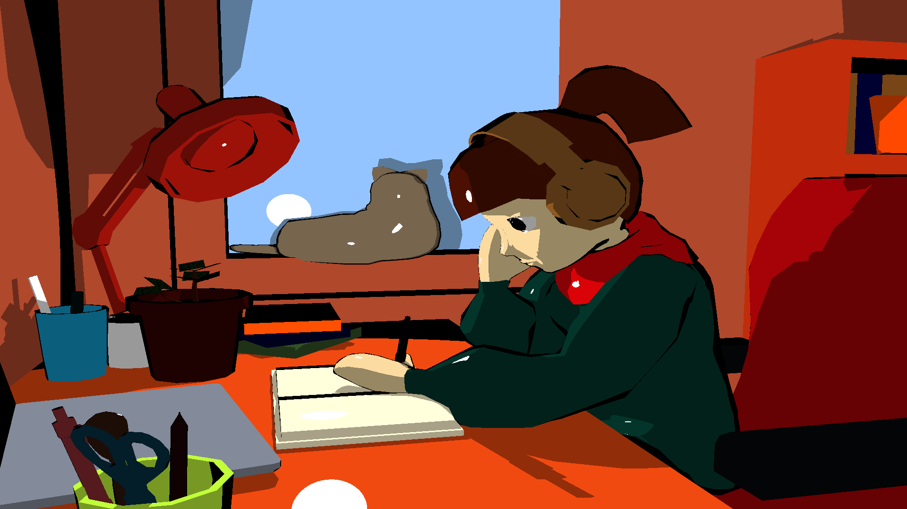
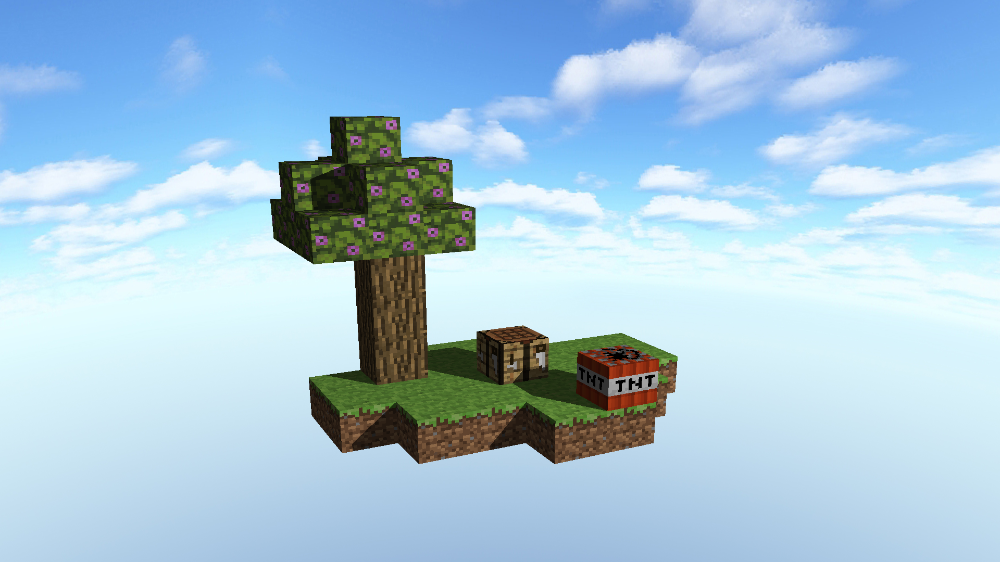

# Raytracer

A raytracer realized in the framework of the course [Introduction at image synthesis](http://jo.fabrizio.free.fr/teaching/synt/index.php) by [Jonathan FABRIZIO](http://jo.fabrizio.free.fr/) at [EPITA](https://www.epita.fr/).

## Realizations




## Features :

* Objects available : sphere, triangle, Axis Aligned Bounding Box (AABB)
* Phong shader
* Reflection
* Blobs (metaballs)
* Smooth triangles
* Multithreading (CPU)
* Cartoon shader
* Object loader (.obj & .mtl)
* UV mapping : AABB and sphere

See TODO.md for further improvement ideas.

## Usage

```
$ mkdir build && cd build
$ cmake ..
$ make -j
$ ./raytracer
```

And follow the USAGE message.
